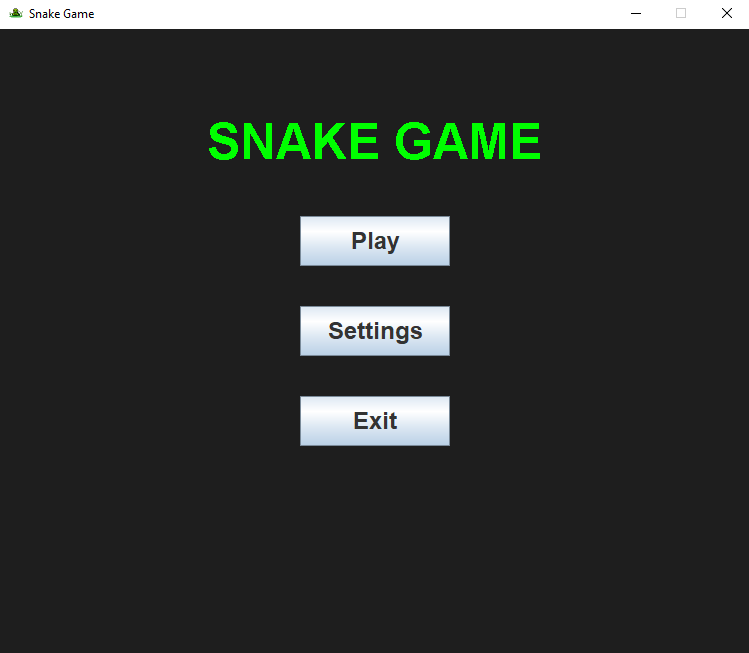
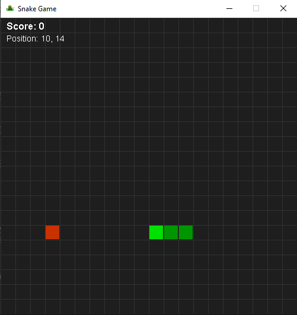

# 🐍 Snake Game

A classic Snake game built with **Java** (Desktop) and **JavaScript** (Web).


---

## 📸 Screenshots

### Main Menu


### Gameplay


### Settings


---

## ✨ Features

- 🎮 Classic snake gameplay
- 🏠 Main menu with Play, Settings, and Controls
- 🔊 Sound effects and background music
- 🎚️ Volume controls (Music & SFX)
- ⏸️ Pause functionality
- 📍 Real-time position display
- 🎯 Score tracking
- 🔄 Restart and menu navigation

---

## 🎮 Controls

| Key | Action |
|-----|--------|
| `W` / `↑` | Move Up |
| `S` / `↓` | Move Down |
| `A` / `←` | Move Left |
| `D` / `→` | Move Right |
| `P` | Pause / Resume |
| `R` | Restart (when game over) |
| `ESC` | Back to Menu |

---

## 🖥️ Java Version (Desktop)

### Requirements

- Java 17 or higher
- Maven (optional)

### Project Structure

```
src/main/java/com/snake/
├── Main.java                 # Entry point
├── utils/
│   ├── Constants.java        # Game settings
│   └── SoundManager.java     # Audio handling
├── entities/
│   ├── Direction.java        # Movement directions
│   ├── Snake.java            # Snake logic
│   └── Food.java             # Food logic
└── game/
    ├── GameState.java        # Game states
    ├── GamePanel.java        # Rendering & game loop
    ├── GameFrame.java        # Window container
    ├── MenuPanel.java        # Main menu
    ├── SettingsPanel.java    # Settings screen
    └── ControlsPanel.java    # Controls screen
```

### How to Run

#### With Maven

```bash
cd snake-game
mvn compile
mvn exec:java -Dexec.mainClass="com.snake.Main"
```

#### Without Maven

```bash
cd src/main/java
javac com/snake/Main.java com/snake/**/*.java
java com.snake.Main
```

#### Build JAR

```bash
mvn package
java -jar target/snake-game-1.0-SNAPSHOT.jar
```

---

## 🌐 Web Version (Browser)

### Project Structure

```
web/
├── index.html          # HTML structure
├── css/
│   └── style.css       # Styling
├── js/
│   └── game.js         # Game logic
├── sounds/
│   ├── eat.wav         # Eat sound effect
│   ├── gameover.wav    # Game over sound
│   └── background.mp3  # Background music
└── images/
    └── icon.png        # Favicon
```

### How to Run

#### Option 1: Direct Open

Simply double-click `web/index.html` or open it in your browser.

#### Option 2: Live Server (VS Code)

1. Install "Live Server" extension in VS Code
2. Right-click on `index.html`
3. Select "Open with Live Server"

#### Option 3: Python Server

```bash
cd web
python -m http.server 8000
```

Then open `http://localhost:8000` in your browser.

### 🎮 Play Online

You can play the web version here: [Play Snake Game](https://jorgecreator19.github.io/Snake-Game/web/)

---

## 🛠️ Technologies Used

### Java Version
- **Java 17** - Programming language
- **Java Swing** - GUI framework
- **Java2D** - Graphics rendering
- **Java Sound API** - Audio playback
- **Maven** - Build tool

### Web Version
- **HTML5** - Structure
- **CSS3** - Styling & animations
- **JavaScript (ES6)** - Game logic
- **Canvas API** - Graphics rendering
- **Web Audio API** - Sound effects

---

## 🎯 Game Rules

1. Control the snake using arrow keys or WASD
2. Eat the red food to grow and earn points (+10)
3. Avoid hitting the walls
4. Avoid hitting your own body
5. Try to get the highest score!

---

## 🚀 Future Improvements

- [ ] High score leaderboard
- [ ] Difficulty levels (speed)
- [ ] Different themes/skins
- [ ] Mobile touch controls
- [ ] Power-ups
- [ ] Obstacles mode
- [ ] Multiplayer mode

---

## 📁 Full Project Structure

```
Snake-Game/
├── README.md
├── pom.xml
├── src/
│   └── main/
│       ├── java/
│       │   └── com/snake/
│       │       ├── Main.java
│       │       ├── utils/
│       │       ├── entities/
│       │       └── game/
│       └── resources/
│           ├── sounds/
│           └── images/
├── web/
│   ├── index.html
│   ├── css/
│   ├── js/
│   ├── sounds/
│   └── images/
└── screenshots/
    ├── menu.png
    ├── gameplay.png
    └── settings.png
```

---

## 👤 Author

**JorgeCreator19**

- GitHub: [@JorgeCreator19](https://github.com/JorgeCreator19)

---

## 📄 License

This project is open source and available under the [MIT License](LICENSE).

---

## 🙏 Acknowledgments

- Classic Snake game for inspiration
- Free sound effects from [Freesound](https://freesound.org/)

---

⭐ **If you like this project, please give it a star!** ⭐